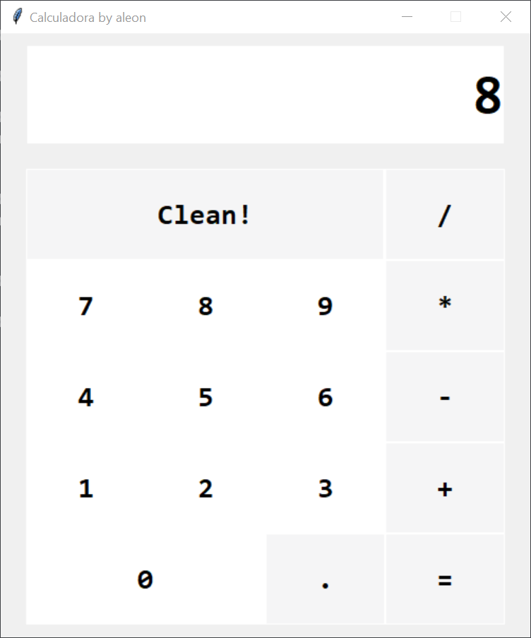

# calcuPyTk

Exemple d'una simple calculadora GUI amb Python i tkinter.

## Requeriments

- OS: based on w10
- python >= 3.8
- tkinter 8.6.12 (pip install tk)

## Run

- python3 calcupytk_aleon.py

